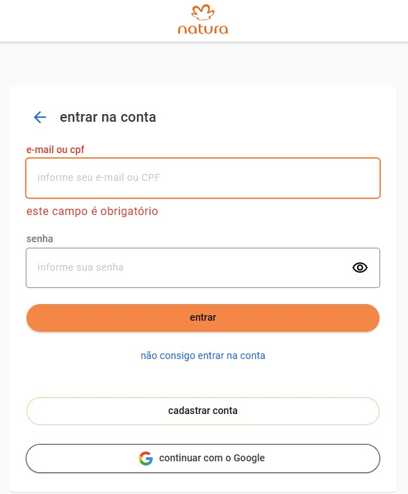

# 🌿 Natura - Testes de Login com Gherkin

Este projeto traz uma abordagem profissional de QA para validar os cenários de login da plataforma da Natura, utilizando a linguagem Gherkin como base para especificação de comportamento (BDD).

---

## ✨ Objetivo

Validar a experiência de login na plataforma Natura através de testes comportamentais que simulam diferentes fluxos de autenticação.

---

## 🧰 Ferramenta

- Linguagem **Gherkin**

---

## 🧪 Cenários Implementados

- ✅ Login com e-mail ou CPF válido
- ❌ Campo "e-mail ou CPF" obrigatório (validação negativa)
- 🔄 Login via Google
- 🔐 Acesso à recuperação de conta
- 🆕 Redirecionamento para cadastro

---
## 🤝 Contribuição
Projeto mantido por Luciana — Quality Assurance apaixonada por usabilidade, comportamento de sistemas e experiências reais.

Sinta-se livre para contribuir com mais cenários, automações ou testes negativos.
---

## 📫 Vamos nos conectar?

Sigo ativa no LinkedIn, sempre aberta para trocar ideias e aprender com outros profissionais da área.

[Meu LinkedIn](https://www.linkedin.com/in/lucianaqa) 
---

